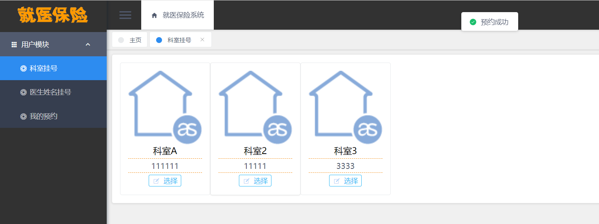
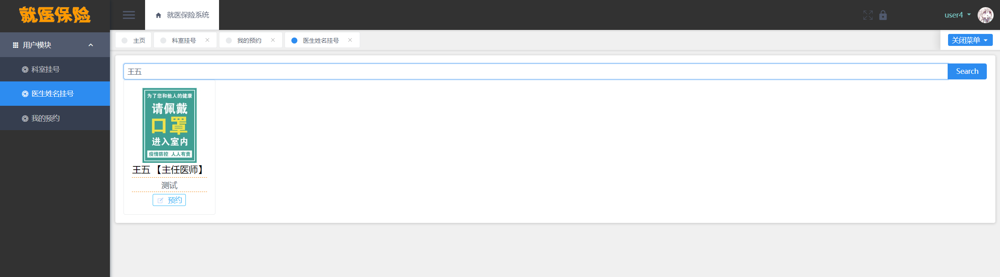

# 就医保险挂号系统

## 软件简介

系统支持挂号用户、管理员角色使用，是一个简洁版的预约挂号系统，另外还包括基础的用户管理、文件管理、角色管理、日志管理等。

**挂号用户**：根据科室挂号、根据医生姓名挂号、查询我的挂号

**管理员**：科室、医生的档案管理，医生放号，以及系统基础的管理。

如您对该系统有技术问题，或有更好的建议，可以在 <https://bbs.csdn.net/topics/611849720> 贴吧中进行反馈。

## 后端项目架构

## 前端项目架构

## 项目需求和业务流程图

## 登录模块

**企业微信扫码登录**，需要自行配置企业 ID 和应用 ID。

## 用户注册

## 登录后主页

## 管理员模块

**医生档案**

**医生添加/编辑页面**

 **医生放号**

**科室档案**

**科室添加/编辑页面**

##  挂号用户模块

**挂号欢迎页**，用于存放相关告示，你可以替换系统的图片，实现自己的业务。

用户点击底部的已阅读按钮后，进入科室挂号页面。

科室下的医生如下所示，如果有号源：

如果没号源：

预约后，提示预约成功，返回科室选择界面

**我的预约模块**

预约成功后，需要点击支付按钮，**进行支付操作**。

点击后，提示支付成功，如下图所示。

除科室挂号外，还支持根据医生姓名挂号，根据医生姓名挂号可以无视号源，直接挂上号，欢迎页和普通挂号一样，如下图所示。

如搜索医生姓名“王五”，点击搜索，如下图所示，可以直接预约。

## 免责声明

- 本项目开源，仅供个人学习使用，遵循 GPL-3.0 开源协议，**转发 / 商用授权请联系作者，否则后果自负**。
- 作者拥有本软件构建后的应用系统全部内容所有权及独立的知识产权。
- 如有问题，欢迎在仓库 Issue 留言，看到后会第一时间回复。相关意见会酌情考虑，但没有一定被采纳的承诺或保证。

下载本系统代码的用户，**必须同意以下内容，否则请勿下载**！

1. 出于自愿而使用/开发本软件，了解使用本软件的风险，且同意自己承担使用本软件的风险。
2. 利用本软件构建的网站的任何信息内容以及导致的任何版权纠纷和法律争议及后果和作者无关，作者对此不承担任何责任。
3. 在任何情况下，对于因使用或无法使用本软件而导致的任何难以合理预估的损失（包括但不仅限于商业利润损失、业务中断与业务信息丢失），作者概不承担任何责任。
4. 必须了解使用本软件的风险，作者不承诺提供一对一的技术支持、使用担保，也不承担任何因本软件而产生的难以预料的问题的相关责任。
